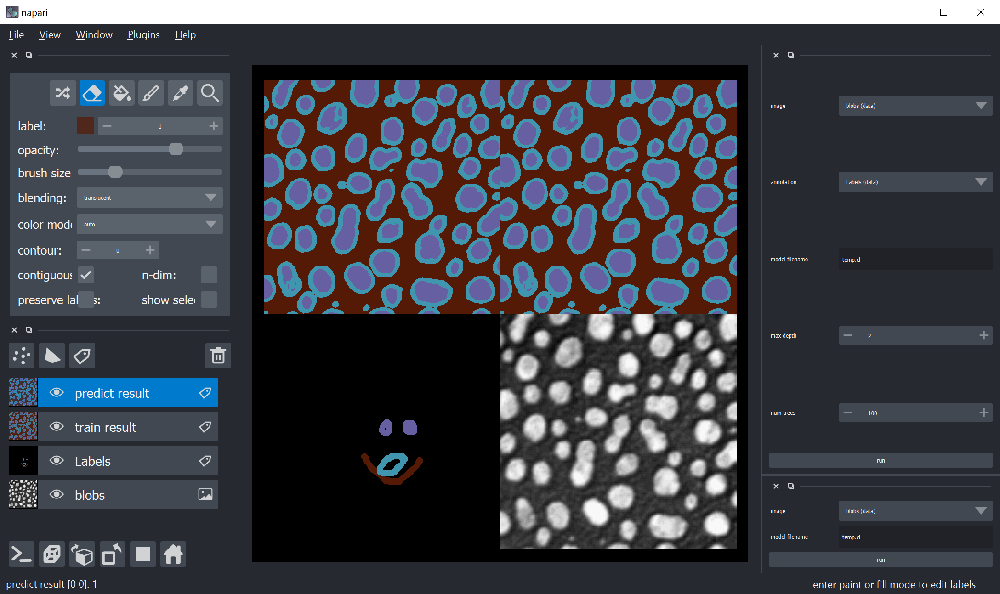

\# napari-oclrfc

OpenCL-based Random Forest Classifier

[cle](https://github.com/clEsperanto/pyclesperanto_prototype) meets [sklearn](https://scikit-learn.org/stable/)

----------------------------------

This [napari] plugin was generated with [Cookiecutter] using with [@napari]'s [cookiecutter-napari-plugin] template.

## Installation

You can install `napari-oclrfc` via [pip]:

    git clone https://github.com/haesleinhuepf/oclrfc
    cd oclrfc
    pip install -e .
    git clone https://github.com/haesleinhuepf/napari-oclrfc
    cd napari-oclrfc
    pip install -e .

## Contributing
 
Contributions are very welcome. Tests can be run with [tox], please ensure
the coverage at least stays the same before you submit a pull request.

## License

Distributed under the terms of the [BSD-3] license,
"napari-oclrfc" is free and open source software

## Issues

If you encounter any problems, please [open a thread on image.sc](https://image.sc) along with a detailed description and tag [@haesleinhuepf](https://github.com/haesleinhuepf).

[napari]: https://github.com/napari/napari
[Cookiecutter]: https://github.com/audreyr/cookiecutter
[@napari]: https://github.com/napari
[MIT]: http://opensource.org/licenses/MIT
[BSD-3]: http://opensource.org/licenses/BSD-3-Clause
[GNU GPL v3.0]: http://www.gnu.org/licenses/gpl-3.0.txt
[GNU LGPL v3.0]: http://www.gnu.org/licenses/lgpl-3.0.txt
[Apache Software License 2.0]: http://www.apache.org/licenses/LICENSE-2.0
[Mozilla Public License 2.0]: https://www.mozilla.org/media/MPL/2.0/index.txt
[cookiecutter-napari-plugin]: https://github.com/napari/cookiecutter-napari-plugin
[file an issue]: https://github.com/haesleinhuepf/napari-oclrfc/issues
[napari]: https://github.com/napari/napari
[tox]: https://tox.readthedocs.io/en/latest/
[pip]: https://pypi.org/project/pip/
[PyPI]: https://pypi.org/
